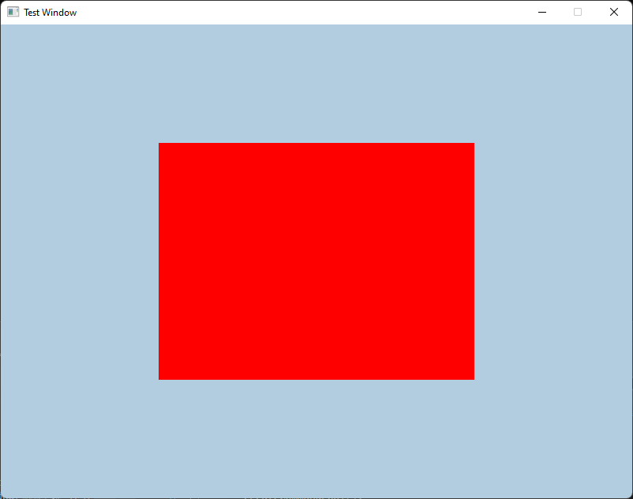

# VulkanProjects

Learning Vulkan, and updating the repo with the projects I did while learning.

HELLO TRIANGLE

Rendering Quad Using Vertex Buffer - Added Position Attribute

Rendering Quad Using Vertex Buffer - Added Color attribute

Rendering Multiple Meshes using Index Buffer
